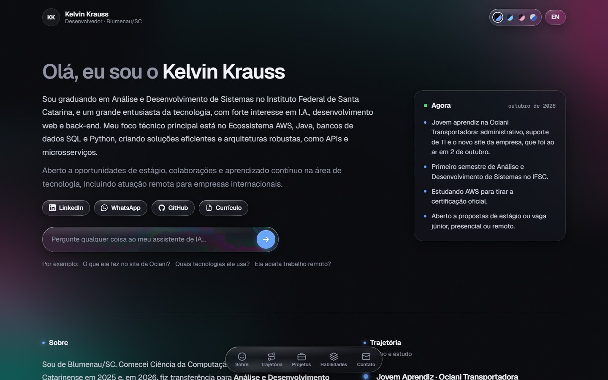

# kelvinkrauss.me

My portfolio: who I am, the projects I've built and how to reach me, in Portuguese and English.
*Meu portfólio: quem eu sou, os projetos que fiz e como falar comigo, em português e inglês.*

**Live:** [kelvinkrauss.me](https://kelvinkrauss.me/)



## What's inside

- **AI assistant.** Visitors can ask questions about my experience. The question box grows into a floating chat window that can be dragged and resized, and turns into a small bubble when you scroll away from it. Answers come from the Gemini API through a Vercel serverless function (`api/chat.js`) and are streamed, so the text appears while it's being written. When an answer is about a part of the page, it ends with a button that scrolls there, turns the chat into its bubble and outlines the target with a ring of light. The API key and the assistant's instructions stay on the server; the browser only sends the conversation, and the function checks its size and format.
- **Project details.** A before/after slider compares the old Ociani website with the one I built. Hovering the other projects shows a real preview: the banking simulator's console output and the microservices layout taken from their configuration.
- **Liquid ink.** A WebGL fluid simulation runs inside the question box and moves into the chat window when it opens. It follows the mouse and stirs itself every few seconds.
- **Ink echo background.** A slow, low-resolution noise field in the same ink colors, only at the edges of the screen. It is enlarged on the GPU with bicubic filtering and dithered, so the dark gradients don't show color banding.
- **Liquid glass.** Buttons and the navigation dock refract what's behind them using an SVG displacement filter (Chromium browsers; others get a plain blur).
- **Four themes** (Escuro, Ardósia, Ameixa, Névoa) with a smooth color transition. The choice is saved for the next visit.
- **Portuguese / English** switch for all text, including the resume, which opens in an in-page viewer on desktop.

No framework and no build step: plain HTML, CSS and JavaScript.

## Structure

```
index.html        page content
css/style.css     all styles
js/fluid.js       WebGL fluid simulation (question box and chat)
js/main.js        chat, themes, language, resume viewer, dock, liquid glass, background
api/chat.js       serverless function that talks to Gemini
404.html          "page not found", in the visitor's theme and language
images/           resume PDFs and images
```

## Running locally

Opening `index.html` in a browser shows the whole site. The assistant needs the serverless function:

```bash
npm i -g vercel
vercel dev          # needs GEMINI_API_KEY in the environment or in .env.local
```

## Testing the assistant

`tests/chat-evals.mjs` sends a set of tricky questions to the assistant (off-topic requests, prompt-injection attempts, translations, English, actions like scrolling or changing the theme) and checks each answer automatically. Run it after changing the prompt:

```bash
node tests/chat-evals.mjs                     # the live site
node tests/chat-evals.mjs http://localhost:3000   # vercel dev
```

## Credits

The fluid simulation in `js/fluid.js` is adapted from [WebGL-Fluid-Simulation](https://github.com/PavelDoGreat/WebGL-Fluid-Simulation) by Pavel Dobryakov, MIT License. The full license notice is at the top of that file.
